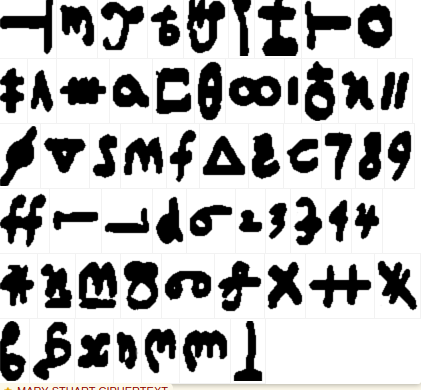
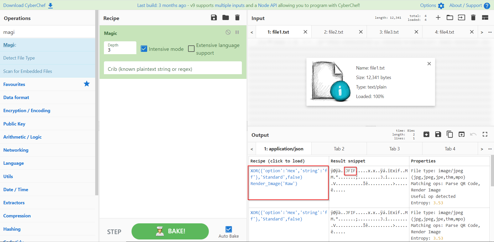
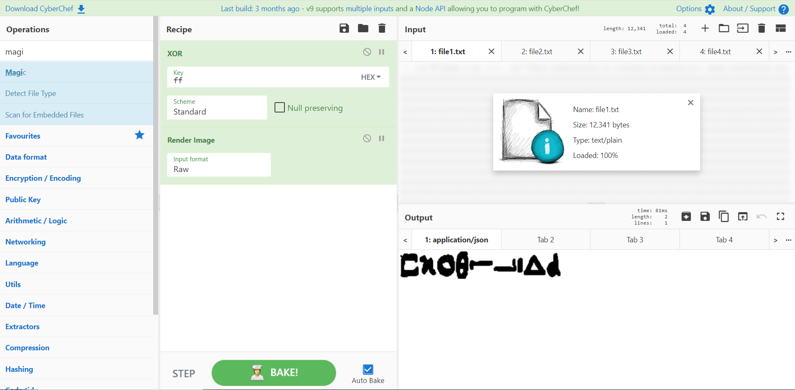

**Queen**
==========

>Description : can you decrypt the queen secret.

First . We got 4 files with strange  character . 

so I used the description to get any hint and found a cipher type called **Mary Queen of Scotes**

according to cipher symbols we are searching for an image 

I tried to merge files to make one file but failed 

so I used [cyber chef](https://github.com/user/repo/blob/branch/other_file.md) with **Magic** recipe 

i knew it decroded by xor with 'ff' key 

so load that recipe and we got the image 

we could easily use [this](https://www.dcode.fr/mary-stuart-code) to decode the symboles and get the flag 

Flag : DONTTRUSTANYQUEEN

