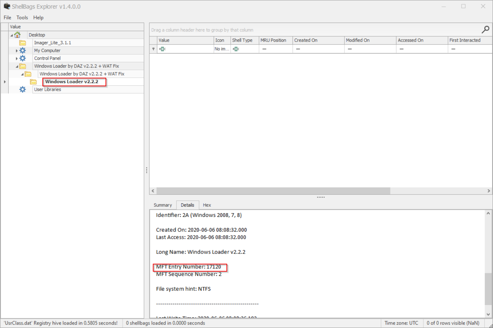

**Malicious File**
====================
>Description :  while investigating a compromised machine the examiner found a suspicious file executed. the file belongs to windows crack he needs to find the MFT entry number for the directory where the file executed.
flag format: md5 of string

this is  **MS Windows registry file ** i tried to use volatility and found no thing 

so i searched about this file i found 

U can about it more [here](https://www.sans.org/reading-room/whitepapers/forensics/windows-shellbag-forensics-in-depth-34545#:~:text=The%20UsrClass.,special%20folders%20and%20virtual%20folders.&text=ShellBag%20registry%20keys%20and%20values%20in%20Windows%207%2C%208%20and,be%20found%20in%20files%20below.&text=%25UserProfile%25%5CAppData%5CLocal%5CMicrosoft%5CWindows%5C%20UsrClass.,-dat.)

Now we need to analysis this file 

I found a  tool called [ShellBagsExplorer](https://f001.backblazeb2.com/file/EricZimmermanTools/ShellBagsExplorer.zip)

as the description say we need to find MFT entry number , I found it in **Windows Loder** folder 

 

now just get the md5 of that number .

flag : d72eecc6b164864790fe25f2bd64a8ab
