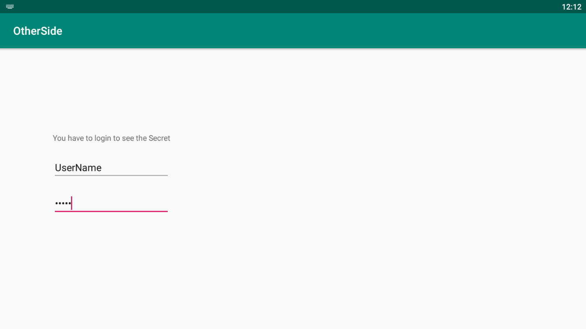
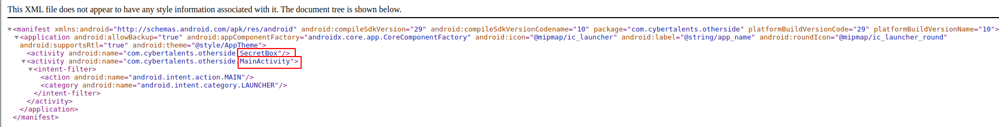
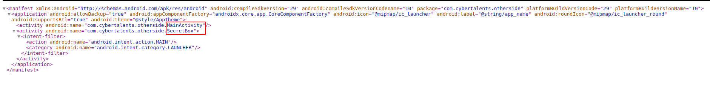
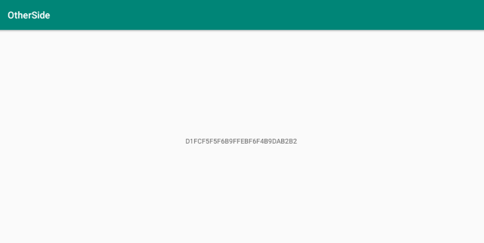

>Description: Developer think That the real Hacker Does not need any buttons to get the flag.

running  the apk we see that it asks for a Username and a Password but there is no buttons to login as description said . 

I used an online apk decompiler to do some analysis but i found nothing usefull 

so i got an idea to bypass the login screen 

After some searching , A friend gave me a hint to change the **Main activity** of the apk  from the **AndroidManifest.xml**

1) decompile the apk 

>apktool d application.apk

2) edit AndroidManifest.xml

from

to

3) now Recompile and sign the app then run it , you can see commands [here](https://medium.com/@sandeepcirusanagunla/decompile-and-recompile-an-android-apk-using-apktool-3d84c2055a82)

we got the flag 

